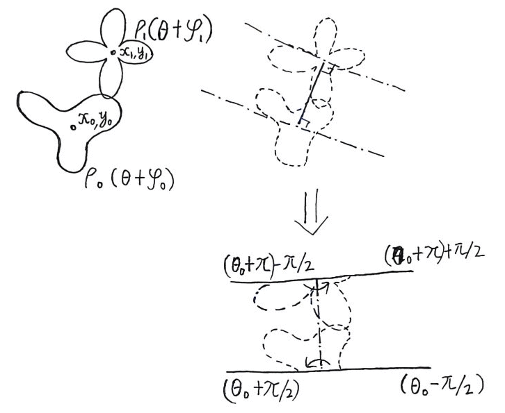
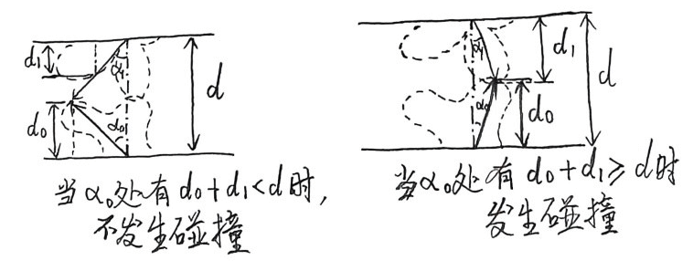

[English](doc/en/algorithm.md)
# 对形状的描述
对于时刻t在角度θ处包络上的点(x,y)有：
```
x = x_0(t) + ρ(θ+φ(t)) * cos(θ)
y = y_0(t) + ρ(θ+φ(t)) * sin(θ)
```
其中`x_0`，`y_0`为t时刻的质心坐标，`φ`为t时刻转动的角度，时隙τ内的运动状态可以描述为：
```
x_0(t+τ) = x_0(t) + v_x * τ
y_0(t+τ) = y_0(t) + v_y * τ
φ(t+τ) = φ(t) + ω * τ
```
# 两物体之间的碰撞检测
设分别由`ρ_0(θ)`和`ρ_1(θ)`两个圆谐函数描述的物体在某一时刻的运动状态为:
```
{ x_0, y_0, φ_0 }
{ x_1, y_1, φ_1 }
```
若要判断两个物体是否发生了碰撞以及在何处发生碰撞，遵循以下步骤：

如上图所示，考虑两点质心连成的线段及线段两端垂直线所包围的空间，空间之外的部分不会发生碰撞。即对于`ρ_0`描述的形状而言，只考虑`θ_0-π/2 < θ < θ_0+π/2`的部分，其中`θ_0`是向量`(x_1,y_1)T-(x_0,y_0)T`与极坐标在`Θ=0`处正方形之间的夹角。对`ρ_1`描述的形状同理。

那么对于任意的`-π/2 < α_0 < π/2`，`ρ_0`质心到其包络表面的射线在两图形质心连线方向上的映射`d_0 = ρ_0(θ+φ_0+α_0) * cos(α_0)`，相应地，我们有`ρ_1`质心到该包络点的夹角：
```
α_1 = atan( (d - d_0) / (ρ_0(θ+φ_0+α_0) * sin(α_0)) )
```
其中
```
d = ||(x_1,y_1)T-(x_0,y_0)T||
```
正如`α_0`可以为负数一样，`α_1`也可以为负数，并同时满足`-π/2 < α_1 < π/2`。
同样地，对于`α_1`，`ρ_1`质心到其包络表面的射线在两质心连线方向上的映射`d_1 = ρ_1(θ+φ_1+π-α_1) * cos(α_1)`。注意到当`d_0+d_1<d`时不发生碰撞，反正则发生碰撞。 
那么两物体的碰撞检测问题即可用最优化问题描述：
```
argmin f(α_0) s.t. -π/2 < α_0 < π/2
```
其中
```
f(α_0) = d_0 + d_1 - d
       = ρ_0(θ+φ_0+α_0) * cos(α_0) + ρ_1(θ+φ_1+π-α_1) * cos(α_1) - d
tan(α_1) = (d - d_0) / (ρ_0(θ+φ_0+α_0) * sin(α_0))
```
若`f(α_0)`在极值点处的函数值`f(α_0)*>=0`则可以认为两物体在对应方向上发生了碰撞。之后将各自在`α_0`与`α_1`上的包络点坐标与法线进行平均处理，即可得到校正后的碰撞点和对应的法线。
> TODO: 本项目中采样梯度下降法求解最优化问题`argmin f(α_0)`，收敛所需的迭代次数大约在5-20次之间，但仅能找到唯一的极值点，对于存在多个碰撞点的情况暂时没有太好的解决方案。